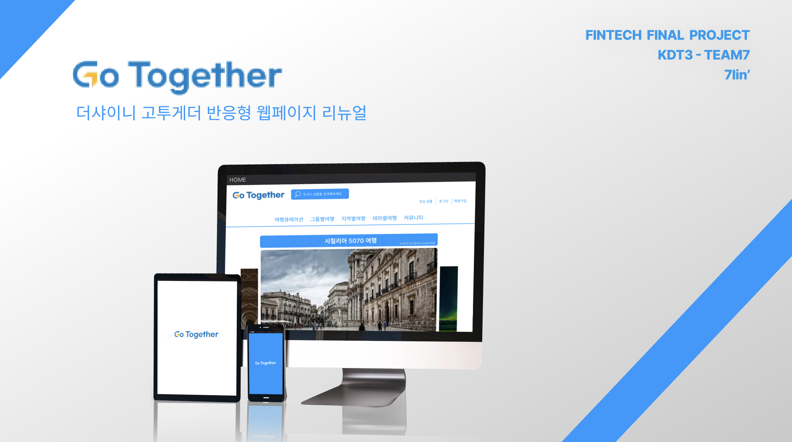
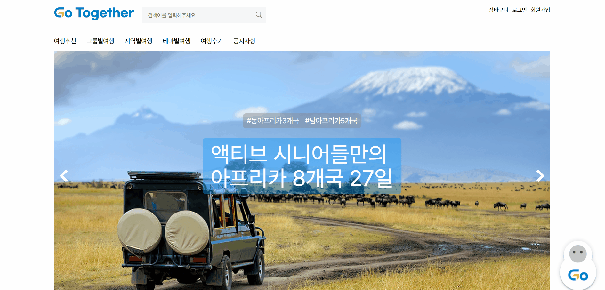
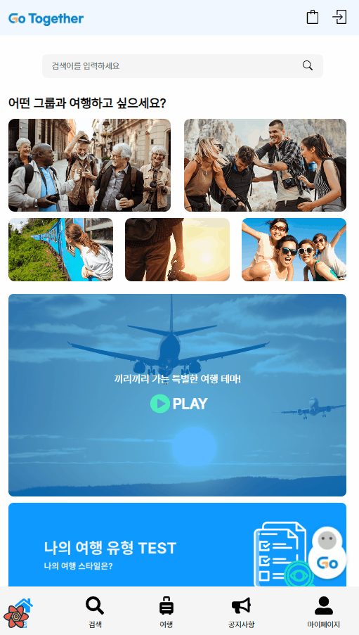
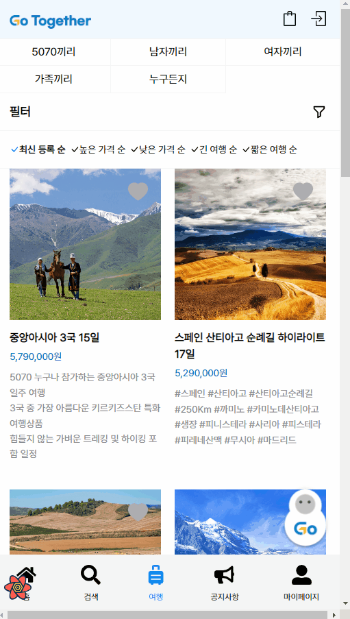

<h1>7lin'-GoTogether</h1>
  
    <h3>
    <b>< KDT3 Front-End : Final Project Team7 ></b>
  </h3>

---

# 1. 프로젝트 소개 💁

### 프로젝트 설명

- 패스트캠퍼스의 핀테크 파이널 프로젝트로 진행된 프로젝트입니다.
- 더샤아니의 고투게더 반응형 웹페이지 리뉴얼로 시니어를 대상으로 한 여행 패키지 상품 검색 및 추천 서비스입니다.
- 주된 기능으로는 로그인, 회원가입, 상품검색, 상품추천, 상품예약, 찜(위시리스트), 후기 등이 있습니다.

### 개발 기간

- 기획: 2023.3.06 ~ 2023.3.19
- 개발: 2023.3.20 ~ 2023.4.10

### 링크 모음

&nbsp;&nbsp;

  

# 2. 팀원 소개 & 역할 분담 👥

|                                                                  소재헌👑                                                                  |                                                       강현주                                                        |                                                         김혜인                                                         |                                                        김효진                                                         |
| :----------------------------------------------------------------------------------------------------------------------------------------: | :-----------------------------------------------------------------------------------------------------------------: | :--------------------------------------------------------------------------------------------------------------------: | :-------------------------------------------------------------------------------------------------------------------: |
|                     |  |  |  |
| 회원가입, 로그인 아이디, 비밀번호 찾기 초기세팅, 내 정보 수정  예약 내역 조회 및 취소   찜(위시리스트) 목록 조회, 추가, 삭제 |                                              메인 페이지 ??? ???                                              |                                                   ??? ??? ???                                                   |                                                  ??? ???  ???                                                  |

  

# 4. 기술 스택 ⚙️

    
  

  

# 5. 협업 방식 🤝

  

- **Github**
   팀 레포지토리를 만들었습니다.
   develop 브랜치와 각자의 이름으로 브랜치를 생성하고,
   작업이 끝나면 각자의 브랜치로 push 후 pull request를 남기면 팀장이 merge 했습니다.
- **Notion**
   팀원별 진행 과정을 공유하고 회의록을 작성할 때 사용했습니다.
- **Slack**
   간단한 질의/응답/요청 등을 위한 메신저, 혹은 pull request 알리미로 사용했습니다.
- **Gather Town**
   회의할 때 주로 사용했고, 설명이 필요한 부분들은 화면도 종종 공유했습니다.

  

# 6. 시연

### 회원가입

 

### 로그인

 

### 챗봇

 

### 여행테스트 및 상품추천

 

### 검색

 

### 찜 등록 및 취소

 

### 상세페이지, 장바구니 페이지

 

### 예약 결제

 

### 카테고리

- 카테고리 정렬
  
   
- 카테고리 필터
  
   
- 카테고리 페이지 넘기기
  
   
- 서브카테고리 선택
  
   

### 공지사항

 

### 개인정보 수정

 

### 아이디,비밀번호 첮기

  

# 7. 느낀 점, 좋았던 점, 아쉬운 점

### 소재헌

- 처음으로 FE, BE, UX/UI 3개의 분야가 한팀으로 협업을 해보았는데 소통이 얼마나 어려운 일인지 알게 되었다. 나름 협업을 잘하는 편이라고 스스로 생각했었는데 그래도 쉽지 않았다. 그리고 FE 팀장 역할을 그래도 나쁘지 않게 잘 한 것 같다. 팀원들도 정말 잘해줘서 정말 고마웠다.
- react-query, recoil 등 새로운 기술들을 사용해 볼 수 있어서 좋았다.
- 기획을 하는데 걸린 시간이 길어서 개벌 시간이 상대적으로 짧았던 부분이 아쉽다.
- 짧은 개발 시간 탓에 완성도 측면에서 떨어진 점이 아쉽다.

### 강현주

-

### 김혜인

-

### 김효진

-
